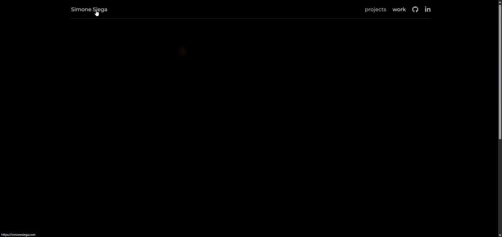

<h1 align="center">Simone Siega — Portfolio</h1>

<p align="center">
Personal portfolio website showcasing my work, projects, and technical interests.
</p>

<p align="center">
  
  
  
</p>

<p align="center">
🌐 <b>Live Website:</b> <a href="https://simonesiega.com">simonesiega.com</a>
</p>

## 🚀 Preview


## About

I am **Simone Siega**, a software developer and computer science student based in **Venice, Italy**.

This repository contains the source code for my personal portfolio website, designed as the main place to explore my work. The site brings together selected projects, experiments, and professional experience, with a focus on **systems-oriented engineering**, **backend development**, and **practical software architecture**.

## What the portfolio includes

- Selected software projects and technical experiments  
- Professional experience and development work  
- The technical direction of my work across systems, backend engineering, and software architecture

Explore the portfolio here:

- [Projects](https://simonesiega.com/projects)
- [Work](https://simonesiega.com/work)

## Running Locally

```bash
npm install
npm run dev
```

Then open:

```bash
http://localhost:3000
```

Optional: copy `.env.example` to `.env` to configure analytics and site settings.

## 🧑‍💻 Contact

- Website: https://simonesiega.com  
- GitHub: https://github.com/simonesiega  
- LinkedIn: https://linkedin.com/in/simonesiega  

## License

This project is licensed under the **MIT License**.

See [LICENSE](LICENSE) for details.
