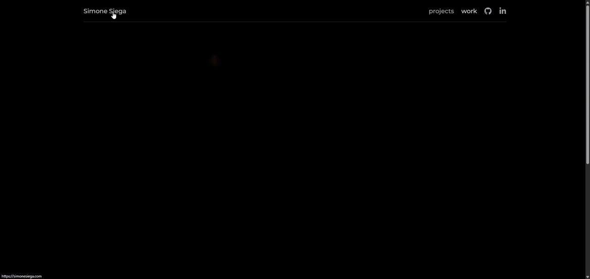

<h1 align="center">Simone Siega — Portfolio</h1>

<p align="center">
  Computer Engineering student at the <a href="https://www.unipd.it/">University of Padua</a>, based in Venice, Italy.
</p>

<p align="center">
  🌐 <b>Live Website:</b> <a href="https://simonesiega.com">simonesiega.com</a>
</p>

<p align="center">
  <sub>Next.js 16 · TypeScript · Tailwind CSS · Bun · GitHub Actions</sub>
</p>

## Preview

<p align="center">
  
</p>

## Overview

This repository contains the source for my personal portfolio. It is the main place where I document selected projects, client work, and the engineering decisions behind them.

Each featured project includes an MDX case study covering the original problem, implementation choices, production constraints, results, and what I would improve next.

The current portfolio includes:

- [Client Web Delivery](https://simonesiega.com/projects/first-client-projects) — my first paid contracts, from contributing to an existing PHP website to owning a CMS-driven platform through production handoff.
- [European Tech Opportunities 2027](https://simonesiega.com/projects/european-tech-opportunities-2027) — an open-source Python pipeline and directory built around deterministic classification, SQLite lifecycle management, restore-tested snapshots, and atomic deployment.
- [Codex Limits](https://simonesiega.com/projects/codex-limits) — my first public npm package, combining a terminal interface, automation output, safe reset-credit redemption, and coding-agent integrations.
- [CFG Parser](https://simonesiega.com/projects/cfg-parser) — my first Rust project, using a hand-written recursive-descent parser to turn a custom grammar into evaluation and structured errors.

Professional experience is collected separately on the [Work page](https://simonesiega.com/work).

## Running Locally

The project uses the Bun version declared in `package.json`.

```bash
git clone https://github.com/simonesiega/portfolio.git
cd portfolio
bun install --frozen-lockfile
cp .env.example .env
bun run dev
```

Open [http://localhost:3000](http://localhost:3000).

The environment file is optional for basic local development. It becomes important when checking canonical metadata, analytics, or production CSP behavior.

## Configuration

| Variable                       | Purpose                                                                         |
| ------------------------------ | ------------------------------------------------------------------------------- |
| `NEXT_PUBLIC_SITE_URL`         | Public origin used for canonical metadata, sitemap, and robots output.          |
| `SITE_URL`                     | Server-side fallback for the public origin and the default Docker build origin. |
| `NEXT_PUBLIC_UMAMI_ENABLED`    | Enables optional Umami analytics when set to `true`.                            |
| `NEXT_PUBLIC_UMAMI_SCRIPT_SRC` | URL of the Umami script; also informs the production CSP.                       |
| `NEXT_PUBLIC_UMAMI_WEBSITE_ID` | Umami website identifier supplied at build time.                                |
| `CSP_MODE`                     | Selects `off`, `report-only`, or `enforce`; production defaults to `enforce`.   |
| `CSP_REPORT_URI`               | Optional endpoint for CSP violation reports.                                    |
| `CSP_CONNECT_SRC_EXTRA`        | Optional space-separated additions to the CSP `connect-src` directive.          |

Production builds require `NEXT_PUBLIC_SITE_URL` or `SITE_URL` so generated URLs never depend on an inferred deployment origin.

## Verification

Run the complete local quality gate with:

```bash
bun run check
```

It checks formatting, linting, TypeScript, unit tests, and a production build. Browser tests run separately:

```bash
bunx playwright install chromium
bun run test:e2e
```

The browser suite discovers indexable routes from the generated sitemap and validates registered work entries directly, so new projects and experience entries do not require duplicated test fixtures.

GitHub Actions repeats those checks on pushes and pull requests. Additional workflows build the standalone application, audit dependencies, run CodeQL, and scan the Docker image for high and critical vulnerabilities.

## Production

The multi-stage Docker build installs dependencies from the lockfile, compiles Next.js standalone output, and copies only the runtime files into the final image. The application runs on port `3000` as a non-root `nextjs` user.

```bash
docker build --build-arg SITE_URL=https://simonesiega.com -t portfolio .
docker run --rm -p 3000:3000 portfolio
```

Public environment variables are embedded during the Next.js build. Changing analytics values only at container runtime does not rewrite already prerendered pages, so production deployments provide matching build-time and runtime configuration.

## Repository Structure

```text
src/app                              routes, metadata, sitemap, and page composition
src/components                       reusable UI, behavior, and animation components
src/lib/config/text/projects         typed project entries and MDX case studies
src/lib/config/text/work             professional experience data
src/styles                           design tokens, components, motion, and accessibility
src/proxy.ts                         Content Security Policy handling
public                               images, project media, icons, and résumé
.github/workflows                    quality, test, build, and security automation
```

## Contact

- [Website](https://simonesiega.com)
- [GitHub](https://github.com/simonesiega)
- [LinkedIn](https://linkedin.com/in/simonesiega)

## License

Licensed under the [MIT License](LICENSE).
