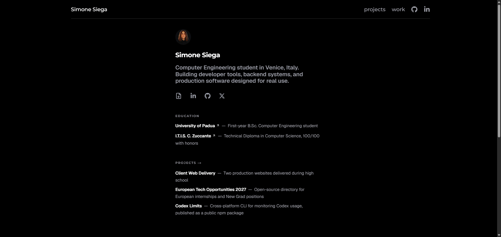

<div align="center">

# Simone Siega

**Computer Engineering student based in Venice, Italy.**

I build thoughtful software, explore complex systems, and turn ideas into products people can use.

[Portfolio](https://simonesiega.com) · [GitHub](https://github.com/simonesiega) · [LinkedIn](https://linkedin.com/in/simonesiega)

<br />

<a href="https://simonesiega.com">
  
</a>

</div>

## About

This repository contains the source for [simonesiega.com](https://simonesiega.com), my personal portfolio and a home for selected work, experience, and ideas.

## Stack

Next.js 16 · React 19 · TypeScript · Tailwind CSS 4 · MDX · Bun

## Run Locally

```bash
git clone https://github.com/simonesiega/portfolio.git
cd portfolio
bun install
bun dev
```

Open [localhost:3000](http://localhost:3000).

## Commands

| Command            | Description                                              |
| ------------------ | -------------------------------------------------------- |
| `bun run dev`      | Start the local development server                       |
| `bun run build`    | Create a production build                                |
| `bun run check`    | Run formatting, linting, type checks, tests, and a build |
| `bun run test`     | Run unit tests                                           |
| `bun run test:e2e` | Run end-to-end tests                                     |
| `bun run format`   | Format the codebase                                      |

## Project Structure

```text
src/app                 Routes, metadata, sitemap, and pages
src/components          Reusable interface and animation components
src/lib/config/text     Portfolio content and project data
src/styles              Design, motion, and accessibility styles
e2e                     End-to-end and accessibility tests
public                  Images, media, and résumé
.github/workflows       Build, quality, test, and security automation
```

## License

Released under the [MIT License](LICENSE).
